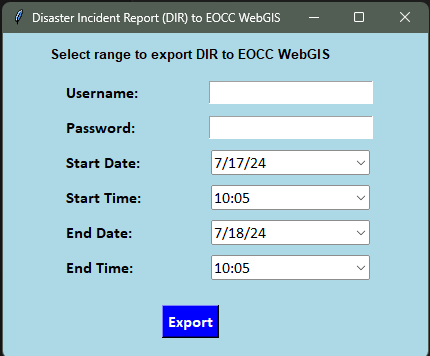

# Disaster Incident Report to EOCC WebGIS

This repository contains a Python application designed to extract disaster incident reports from KoboToolbox, process the data, and upload it to the EOCC WebGIS platform. The application features a graphical user interface (GUI) for user-friendly interaction.



## Features

- **User Authentication:** Secure login with username and password.
- **Date and Time Selection:** Specify the start and end date-time range for data extraction.
- **Data Extraction:** Fetch data from KoboToolbox based on the specified date-time range.
- **Data Processing:** Normalize and filter the extracted data, convert geographical coordinates, and create shapefiles.
- **Data Export:** Save the processed data as CSV and shapefiles.
- **Data Upload:** Upload the shapefiles to the EOCC WebGIS platform.

## Requirements

- Python 3.x
- pandas
- geopandas
- shapely
- tkinter
- tkcalendar
- requests
- koboextractor

## Installation

1. Clone the repository:
    ```sh
    git clone https://github.com/your-username/disaster-incident-report-eocc-webgis.git
    cd disaster-incident-report-eocc-webgis
    ```

2. Install the required packages:
    ```sh
    pip install pandas geopandas shapely tkinter tkcalendar requests koboextractor
    ```

## Usage

1. Replace the placeholders in the script with your KoboToolbox token and form ID.

    ```python
    your_token = 'your_kobo_token'
    form_id = 'your_form_id'
    ```

2. Run the script:
    ```sh
    python main.py
    ```

3. Use the GUI to input your username, password, start date, start time, end date, and end time.

4. Click the "Export" button to process and upload the data.

## File Structure

- `main.py`: Main script containing the GUI and data processing logic.
- `README.md`: This file, providing an overview and instructions.

## Contributing

Contributions are welcome! Please submit a pull request or open an issue for any changes or suggestions.
